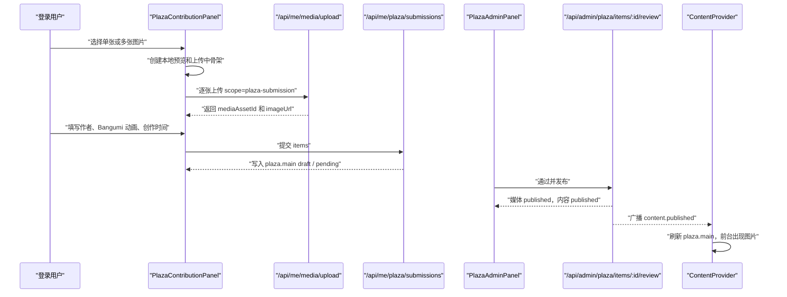

# 图库与图片实现交接

更新日期：2026-06-11

本文档用于交接当前网站的图片、图库、用户投稿、后台审核和媒体资源存储实现。当前“相册/图库”主要指前台 `#plaza` 页面与后台图库中心，不包括电影放映库的海报刮削逻辑。

## 快速结论

- 前台图库页面在 `src/pages/Plaza.tsx`，读取内容 key `plaza.main`，只展示 `visibility === "visible"` 的图库作品。
- 图库数据目前仍保存在内容系统的 `content_entries.key = 'plaza.main'` 中，结构化表 `artwork_items` 已建但当前主链路没有使用。
- 图片上传统一落到 `media_assets` 表和 `server/data/uploads`，或 S3/R2 兼容对象存储。上传时会 best-effort 生成 150/400/800 三档 WebP 缩略图。
- 后台通用图片上传组件是 `src/components/ImageUploadField.tsx`；前台用户投稿专用面板是 `src/components/PlazaContributionPanel.tsx`。
- 用户补充图片需要登录，图片先上传为 `pending` 媒体资源，再创建 `visibility: "pending"` 的图库条目。管理员通过后发布到前台，拒绝后删除待审核条目并硬删除对应上传文件和缩略图。
- 图库反馈需要登录，保存到 `feedback.submissions`，`source` 为 `plaza`，关联图片和截图信息放在 `metadata` 与 `imageUrls` 中。

## 核心代码地图

| 模块 | 文件 | 责任 |
| --- | --- | --- |
| 前台图库页 | `src/pages/Plaza.tsx` | 搜索、排序、标签筛选、信息显示开关、渲染投稿入口和图库卡片 |
| 图库卡片 | `src/components/SoulImageCard.tsx` | 单张图库卡片展示，识别媒体 ID 后可走响应式图片接口 |
| 图片加载组件 | `src/components/OptimizedImage.tsx` | loading 骨架、淡入、错误兜底、`srcSet/sizes` 支持 |
| 通用后台上传 | `src/components/ImageUploadField.tsx` | 工作台表单用上传字段，支持点击、拖拽、手填 URL |
| 前台投稿与反馈 | `src/components/PlazaContributionPanel.tsx` | 胶囊入口、批量上传、Bangumi 搜索、反馈表单、登录弹窗 |
| 内容客户端 | `src/content/client.ts` | API base 推断、图片 URL helper、上传 helper、内容读取 helper |
| 内容上下文 | `src/content/ContentProvider.tsx` | 启动拉取 `/api/public/bootstrap`，通过 SSE 刷新发布内容 |
| 类型定义 | `src/content/types.ts` | `PlazaContent`、`PlazaSoulItem`、`MediaAssetRecord`、`FeedbackSubmission` |
| 后台图库管理 | `src/workspace/PlazaAdminPanel.tsx` | 手动编辑、每周导入、批量上传、待审核投稿通过/拒绝 |
| 图片存储后端 | `server/index.ts` | 上传路由、媒体资源保存、用户投稿、反馈、审核、图片查询 |
| 缩略图工具 | `server/image-store.ts` | Sharp 生成 WebP 缩略图，构造缩略图 URL |
| 数据库结构 | `server/schema.sql` | `media_assets`、预留 `artwork_items`、内容/反馈相关表 |

## 当前数据模型

### `PlazaContent`

定义在 `src/content/types.ts`：

```ts
export type PlazaContent = {
  souls: PlazaSoulItem[];
  moments: PlazaMomentItem[];
  groups: PlazaGroupItem[];
  tags: string[];
};
```

当前前台只使用 `souls` 和 `tags`。`moments/groups` 仍在类型里保留，但不是图库主展示链路。

### `PlazaSoulItem`

图库单张作品的核心字段：

- `id`：图库条目 ID。
- `name`：前台标题。用户投稿选择 Bangumi 后，用动画名作为标题，重名会自动追加序号。
- `author`：图片作者。
- `tags`：前台标签筛选来源之一。用户投稿会带“用户投稿”和动画名。
- `createdAt`：创作或导入日期。
- `avatarSrc`：前台实际渲染的图片地址。
- `featured`：精选状态。
- `visibility`：`visible | hidden | pending | rejected`。
- `mediaAssetId`：上传资源 ID。用户投稿会保存，后台审核会用它更新或删除媒体资源。
- `sourceAnimeTitle/sourceAnimeId/sourceAnimeUrl`：Bangumi 来源动画信息。
- `submittedByUserId/submittedByName/submittedAt`：投稿用户信息。
- `reviewedAt/reviewedBy/reviewNote`：审核信息。
- `importBatchId/importYear/importWeek/importDate/seriesName/seriesIndex/itemIndex`：每周导入或用户批次信息。
- `submissionKind`：`user-single | user-batch | admin-weekly`。

### `MediaAssetRecord`

上传图片资源保存在 `media_assets` 表，类型在 `src/content/types.ts`：

- `id`：形如 `media-时间戳-random`。
- `ownerId`：用户或管理员 ID，未登录公共上传可能为空。
- `url`：原图 URL。
- `thumbnailUrl`：400w 缩略图 URL，当前 Plaza 主展示不一定使用。
- `mimeType/fileSize/hash`：文件元数据。
- `status`：`draft | pending | published | hidden | deleted`。
- `metadata`：包含 `storage`、`objectKey`、`scope`、`thumbnails`，用户投稿后还会补 `plazaSubmissionId` 和 `plazaSubmissionBatchId`。

### 预留但未使用的 `artwork_items`

`server/schema.sql` 已建 `artwork_items`，字段包括 `media_id/title/image_url/tags/series/import/status/metadata`。但当前图库仍走 `content_entries.key = 'plaza.main'`。如果后续图库数量增长，建议再把 `PlazaSoulItem` 迁移到 `artwork_items`。

## 内容读取与发布链路

前台启动时：

1. `ContentProvider` 调用 `fetchBootstrap()` 请求 `/api/public/bootstrap`。
2. 返回的 `content` 放进全局上下文。
3. `Plaza` 通过 `useContent<PlazaContent>("plaza.main", defaultPlazaContent)` 读取图库。
4. 如果内容 API 不可用，会降级使用 `src/content/defaults/plaza.ts`。
5. `ContentProvider` 连接 `/api/realtime/content`，收到 `content.published` 后调用 `/api/public/content?keys=...` 刷新对应内容。

后端 `publicContent()` 会隐藏 `feedback.submissions`，但 `plaza.main` 直接返回已发布内容。前台再在页面层过滤 `visibility === "visible"`。

注意：`server/index.ts` 已经注册了内容 API，文件末尾又调用 `registerContentRoutes()` 注册同名内容接口。Express 会先命中前面注册的路由。后续改 `/api/public/bootstrap`、`/api/public/content`、`/api/admin/content` 时，要优先确认 `server/index.ts` 中当前生效实现，并考虑清理重复注册。

## 前台图库展示

文件：`src/pages/Plaza.tsx`

功能：

- 搜索：匹配 `name`、`author`、`tags`。
- 标签筛选：按钮来自 `plaza.tags`，如果为空则从可见作品里收集。
- 排序：
  - `default`：精选优先，再按浏览量，再按名称。
  - `hot`：按点赞数。
  - `new`：按 `createdAt` 日期。
- 信息显示开关：
  - `all`：显示作者、标签、点赞、浏览等详情。
  - `hidden`：隐藏卡片详情，仅展示图片。
- 瀑布流：使用 CSS columns，`columns-1 sm:columns-2 md:columns-3 xl:columns-4`。
- 用户入口：筛选卡片下方渲染 `PlazaContributionPanel`。

文件：`src/components/SoulImageCard.tsx`

卡片行为：

- 对字段做运行时兜底，避免脏数据导致白屏。
- 如果 `avatarSrc` 中能解析出 `media-...`，则使用：
  - `getImageUrl(assetId, { w: 400 })`
  - `getImageSrcSet(assetId)`，默认 150/400/800。
- 如果解析不到媒体 ID，则直接使用 `avatarSrc`。
- 图片加载使用 `OptimizedImage`，固定 `aspectRatio="1/1"`，失败后展示渐变和首字兜底。

重要现状：当前上传 helper 保存到 `PlazaSoulItem.avatarSrc` 的通常是原图 URL，而不是 `/api/public/images/:id` 或缩略图 URL。因此很多后台上传和用户投稿图片会直接渲染原图，不一定命中响应式缩略图链路。`mediaAssetId` 已经保存到用户投稿条目，但 `SoulImageCard` 目前没有直接使用 `mediaAssetId`。

## 图片组件与上传组件

### `OptimizedImage`

位置：`src/components/OptimizedImage.tsx`

能力：

- 内部状态：`loading | loaded | error`。
- loading 时展示 pulse 骨架。
- load 成功后淡入。
- error 时展示 fallback 渐变、首字或默认图标。
- 支持 `srcSet`、`sizes`、`loading`、`decoding`、`aspectRatio`。

### `ImageUploadField`

位置：`src/components/ImageUploadField.tsx`

用于后台多个编辑器：

- `PostAdminPanel`：文章封面。
- `ScreeningsAdminPanel`：海报。
- `GamingAdminPanel`：游戏封面和轮播图。
- `TalksAdminPanel`：杂谈默认录播封面和单条封面。
- `PlazaAdminPanel`：图库图片。

行为：

- 支持点击上传、拖拽上传、手动粘贴 URL。
- 前端允许 `JPEG/PNG/WebP/GIF/AVIF`，并允许部分 `application/octet-stream` 通过扩展名兜底。
- 推荐单文件 15MB 内。
- 调用 `uploadImageAsset(authFetch, file, { admin, scope })`。
- `admin: true` 时请求 `/api/admin/media/upload`；否则请求 `/api/me/media/upload`。
- 上传成功后 `onChange(result.asset.url)`，也就是保存原图 URL。

## 后端媒体存储

核心在 `server/index.ts` 和 `server/image-store.ts`。

### 上传校验

后端使用 `multer.memoryStorage()`：

- 文件字段名固定为 `file`。
- 文件大小由 `MEDIA_UPLOAD_MAX_BYTES` 控制，默认 15MB。
- 初筛 MIME：`image/jpeg | image/png | image/webp | image/gif | image/avif`，也允许 `application/octet-stream`。
- 二次校验文件头：JPEG、PNG、WebP、AVIF、GIF 魔数。文件头不匹配会拒绝。

### 保存位置

默认本地存储：

- 原图保存到 `server/data/uploads/<objectKey>`。
- Express 通过 `/uploads` 静态托管 `server/data/uploads`。
- URL 形如 `http://localhost:8787/uploads/uploads/<scope>/<year>/<month>/<timestamp>-<random>-<name>.<ext>`。

S3/R2 兼容存储：

- `OBJECT_STORAGE_DRIVER=s3` 或 `r2`。
- `OBJECT_STORAGE_ENDPOINT`、`OBJECT_STORAGE_BUCKET`、`OBJECT_STORAGE_REGION`、`OBJECT_STORAGE_ACCESS_KEY_ID`、`OBJECT_STORAGE_SECRET_ACCESS_KEY` 控制上传。
- `OBJECT_STORAGE_PUBLIC_BASE_URL` 用作浏览器可访问的公共 URL。
- `OBJECT_STORAGE_PREFIX` 默认是 `uploads`。

### 缩略图

`generateThumbnails(buffer, assetId, dataDir)` 会生成：

- `server/data/uploads/thumbs/<media-id>_150w.webp`
- `server/data/uploads/thumbs/<media-id>_400w.webp`
- `server/data/uploads/thumbs/<media-id>_800w.webp`

缩略图生成是 best-effort，失败不会阻断上传。

已知限制：

- 缩略图当前总是写本地磁盘，没有上传到 S3/R2。
- 如果对象存储配置了 `OBJECT_STORAGE_PUBLIC_BASE_URL` 指向桶域名，缩略图 URL 可能指向对象存储但实际文件只在本地。对象存储上线前需要补“缩略图上传到对象存储”或让 public base 指向能访问本地 thumbs 的后端域名。
- `/api/public/images/:id` 会根据 `media_assets.metadata.thumbnails` 选择缩略图，但只查询 `status = 'published'` 的媒体资源。
- `format=auto/avif/webp/jpeg` 当前主要作为返回字段，实际缩略图产物是 WebP，没有动态转码成 AVIF 或 JPEG。

## 用户补充图片流程

前端文件：`src/components/PlazaContributionPanel.tsx`

入口：

- 位于图库搜索与标签卡片下方。
- 两个胶囊按钮：`我想补充图片`、`我想反馈`。
- 未登录点击会打开 `AuthModal`，不会创建投稿。
- 面板用 `AnimatePresence` 和 `motion.div` 平滑展开。

上传流程：

1. 用户点击 `上传单张或多张`。
2. `<input type="file" multiple>` 选择图片。
3. `handleUploadFiles()` 立刻复制 `FileList`，然后清空 input value，保证同一文件可重复选择。
4. 前端校验格式和 15MB 大小。
5. 为每张图片创建 `UploadDraft`：
   - `previewUrl = URL.createObjectURL(file)`
   - `uploadState = "uploading"`
   - 默认作者为当前用户昵称
   - 默认创作时间为当天
6. UI 立即显示预览卡片、上传中遮罩、三条胶囊骨架。
7. 逐张调用 `uploadImageAsset(authFetch, file, { scope: "plaza-submission" })`。
8. 成功后写入 `mediaAssetId` 和 `imageUrl`，状态变为 `ready`。
9. 失败后状态变为 `error`，卡片展示错误提示，用户可删除后重新上传。
10. 多张上传时显示本次上传周卡片，按当天计算第几周。

补充元数据：

- 每张 ready 卡片下方有作者输入。
- 每张 ready 卡片下方有 Bangumi 搜索胶囊。
- 每张 ready 卡片下方有创作日期输入。

Bangumi 搜索：

- 组件：`BangumiSearchCapsule`。
- 输入至少 2 个字符才搜索。
- 320ms debounce。
- 请求：`GET /api/me/bangumi/search?q=...`。
- 后端复用 `searchBangumiCandidates()`，只返回 `id/title/originalTitle/year/posterUrl/url`。
- 选择结果后写入 `sourceAnimeTitle/sourceAnimeId/sourceAnimeUrl`。

提交审核：

1. 点击 `提交审核`。
2. 前端阻止以下情况：
   - 还没有上传图片。
   - 有图片仍在上传。
   - 有上传失败图片未删除。
   - 任一图片缺作者或来源动画。
3. 请求 `POST /api/me/plaza/submissions`。
4. 后端限制最多 24 张。
5. 后端校验上传资源归属当前用户，避免拿别人的 `mediaAssetId` 投稿。
6. 后端在 `plaza.main` 的 draft 里插入 `visibility: "pending"` 的 `PlazaSoulItem`。
7. 后端将媒体资源状态标记为 `pending`，并补写投稿 ID 和批次 ID。
8. 因为只是 draft 更新，前台图库不会显示。

标题和标签规则：

- `name` 使用用户选择的 Bangumi 动画标题。
- 如果标题已存在，会自动追加序号，例如 `作品名 1`、`作品名 2`。
- `tags` 包含“用户投稿”和动画标题。

## 图库反馈流程

前端文件：`src/components/PlazaContributionPanel.tsx`

入口：点击 `我想反馈`。

字段：

- 反馈类型胶囊：
  - 图片错误
  - 作者信息
  - 标签问题
  - 侵权/版权
  - 其他
- 可选关联图库图片，下拉来自当前可见 `visibleSouls`。
- 反馈说明，至少 6 个字符。
- 可上传多张截图。

截图上传：

- 使用 `uploadImageAsset(authFetch, file, { scope: "plaza-feedback" })`。
- 走登录用户上传接口 `/api/me/media/upload`。
- 当前该 scope 的资源状态是 `published`。

反馈提交：

- 请求 `POST /api/public/feedback-submissions`，但 `source: "plaza"` 时后端强制要求登录。
- `imageUrls` 保存截图 URL。
- `metadata` 保存：
  - `issueType`
  - `issueLabel`
  - `plazaItemId`
  - `plazaItemTitle`
- 后端保存到 `feedback.submissions` 的 draft，状态默认为 `pending`，命中违禁词会自动 `rejected`。

已知限制：`src/pages/Workspace.tsx` 的反馈审核列表目前没有专门把 `feedback.source === "plaza"` 显示为“图库反馈”，可能会落到默认文案。数据本身已经通过 `source` 和 `metadata` 区分。

## 后台图库管理

文件：`src/workspace/PlazaAdminPanel.tsx`

### 加载与保存

- 后台加载 `/api/admin/content`，取 `plaza.main` 的 draft。
- 保存草稿：`PATCH /api/admin/content/plaza.main/draft`。
- 保存并发布：先 PATCH draft，再 `POST /api/admin/content/plaza.main/publish`。
- 保存时带 `expectedVersion` 和 `expectedUpdatedAt`，用于避免覆盖别人刚改过的内容。

### 手动编辑

管理员可编辑：

- 标题、作者、日期、点赞、浏览量。
- 标签和简介。
- `visibility`：可见、隐藏、待审核、已拒绝。
- 精选状态。
- 图片地址，使用 `ImageUploadField`，scope 为 `plaza-item`。

注意：手动删除普通图库项会从 `plaza.main` 删除并发布，但不会自动硬删除对应上传文件。只有“拒绝用户待审核投稿”会触发媒体文件硬删除。

### 每周导入

后台支持两种导入：

- 粘贴图片 URL。
- 上传多张图片并自动发布。

上传多张图片：

1. 前端校验格式和 15MB 大小。
2. 逐张请求 `/api/admin/media/upload`，scope 为 `plaza-weekly`。
3. 收集 `asset.url`。
4. `publishWeeklyUrls()` 去重已有 `avatarSrc`。
5. 新建 `visibility: "visible"` 的图库条目。
6. 标题格式为 `<dateKey>-<paddedIndex>`。
7. 标签包含“每周杂谈”、系列标签、周标签、导入日期标签。
8. 立即保存并发布。

### 用户投稿审核

后台待审核条目会显示：

- 投稿用户。
- 投稿时间。
- 来源动画。
- 资源 ID。

审核按钮：

- `通过并发布`：调用 `PATCH /api/admin/plaza/items/:id/review`，`decision: "approve"`。
- `拒绝并删除`：调用同一接口，`decision: "reject"`。

后端行为：

- 通过：
  - 把条目改为 `visibility: "visible"`。
  - 放入 published 内容。
  - 合并标签。
  - 把媒体资源标记为 `published`。
  - 广播 `content.published`，前台 SSE 刷新。
- 拒绝：
  - 从 draft 和 published 中移除该条目。
  - 如果是用户投稿，调用 `hardDeleteMediaAsset()`。
  - 删除原图和 150/400/800 缩略图。
  - DB 中把媒体资源状态更新为 `deleted`。

## API 速查

| API | 权限 | 用途 | 关键说明 |
| --- | --- | --- | --- |
| `GET /api/public/bootstrap` | 公开 | 初次加载全站发布内容 | 返回所有 public content，`feedback.submissions` 被隐藏 |
| `GET /api/public/content?keys=plaza.main` | 公开 | 刷新指定内容 | SSE 收到发布事件后调用 |
| `POST /api/me/media/upload` | 登录 | 用户上传图片 | `scope=plaza-submission` 时资源状态为 `pending`，其他用户 scope 当前为 `published` |
| `POST /api/admin/media/upload` | 管理员/站主 | 后台上传图片 | 资源状态默认为 `published` |
| `POST /api/public/media/upload` | 公开限流 | 公共反馈类上传 | 当前 About/通用反馈使用；图库投稿不用它 |
| `GET /api/me/bangumi/search?q=...` | 登录 | 投稿选择来源动画 | 返回最多 8 条 Bangumi 候选 |
| `POST /api/me/plaza/submissions` | 登录 | 创建图库待审核投稿 | 最多 24 张，写入 `plaza.main` draft |
| `PATCH /api/admin/plaza/items/:id/review` | 管理员/站主 | 图库投稿审核 | approve 发布，reject 删除条目和用户投稿媒体文件 |
| `GET /api/public/images/:id?w=&format=&return=` | 公开 | 通过媒体 ID 取发布图片/缩略图 | 只查 `media_assets.status = 'published'` |
| `GET /api/public/image-proxy?url=...` | 公开 | 代理远程图片 | 用于部分外部图源 |
| `POST /api/public/feedback-submissions` | 公开，图库要求登录 | 提交反馈 | `source=plaza` 强制登录 |

## 端到端流程图



## 排查清单

### 用户选择图片后没有反应

优先检查：

- 是否已登录。未登录应弹出 `AuthModal`。
- 浏览器 Network 是否请求 `/api/me/media/upload`。
- 请求是否 401/403，通常是登录态、cookie 或 `authFetch` 问题。
- 请求是否 413，说明超过 `MEDIA_UPLOAD_MAX_BYTES`。
- 请求是否 400，检查文件类型或文件头。
- `CONTENT_API_BASE` 是否指向正确后端，默认会推断为 `http://当前hostname:8787`。
- 后端控制台是否打印 `Image upload failed`。
- 本地是否写入 `server/data/uploads`。
- 数据库 `media_assets` 是否新增记录。
- 前端 `uploadDrafts` 是否出现 `uploadState: "uploading" | "ready" | "error"`。

### 投稿提交后前台不显示

这是预期行为。用户投稿只写入 draft，且 `visibility` 为 `pending`。需要后台通过审核后才会进入 published 内容并展示。

### 后台通过后仍不显示

检查：

- `plaza.main` published 里是否有该条目。
- 条目 `visibility` 是否为 `visible`。
- 媒体资源 `status` 是否为 `published`。
- 前台是否收到 `content.published` SSE。
- 手动刷新后 `/api/public/content?keys=plaza.main` 是否返回新条目。
- `SoulImageCard` 是否能加载 `avatarSrc`。

### 图片 404 或白图

检查：

- `avatarSrc` 是原图 URL、缩略图 URL，还是 `/api/public/images/:id`。
- 如果走 `/api/public/images/:id`，`media_assets` 必须存在且状态为 `published`。
- 如果是本地 URL，确认 `/uploads` 静态目录能访问。
- 如果是对象存储 URL，确认桶域名、权限、CORS 和 `OBJECT_STORAGE_PUBLIC_BASE_URL`。
- 如果用缩略图，确认 `server/data/uploads/thumbs` 里有对应 WebP。

## 已知限制与建议

- Plaza 当前以 `plaza.main` 内容 entry 为主，不是结构化图库表。长期建议迁移到 `artwork_items + media_assets`。
- `PlazaSoulItem.mediaAssetId` 已用于用户投稿审核，但前台卡片展示没有直接用它。建议后续让 `SoulImageCard` 优先使用 `mediaAssetId` 生成 `/api/public/images/:id`，再回退 `avatarSrc`。
- 后台 `ImageUploadField` 和每周导入保存的是 `asset.url` 原图 URL，导致缩略图和响应式图片不一定被用上。
- 用户投稿的 pending 原图在本地存储下可能仍可通过 `/uploads/...` 直接访问，只是不会在前台列表展示。如果需要严格隐藏待审核图片，应避免公开静态托管 pending 资源，或引入按状态鉴权的文件服务。
- 对象存储下缩略图没有上传到对象存储，这是上线对象存储前最需要补的图片链路问题。
- `POST /api/public/media/upload` 是公开限流上传，当前图库投稿不用它。若开放范围扩大，需要重新评估滥用和存储成本。
- 普通后台删除图库项不会清理媒体文件。若要控制存储体积，需要为后台删除增加可选硬删除逻辑。
- `server/index.ts` 和 `server/routes/content.ts` 存在内容 API 重复注册。建议后续统一到一个实现。
- 旧文档 `WEBSITE_DEPLOYMENT_ANALYSIS.md` 中“图片上传系统尚未实现”的描述已经过期，当前实现已有上传、缩略图、投稿审核和反馈截图。

## 建议测试用例

- 未登录点击 `我想补充图片` 和 `我想反馈`，应打开登录弹窗，不创建投稿。
- 登录后上传单张图片，应立即出现本地预览、上传中遮罩、骨架胶囊和状态提示。
- 上传不支持格式或超过 15MB，应前端提示并不请求后端。
- 上传成功后填写作者、Bangumi 动画、日期，提交后前台不显示，后台出现待审核项。
- 批量上传后应显示本次上传周卡片，每张图都能独立填写来源动画。
- Bangumi 搜索应覆盖加载、无结果、请求失败和选择结果。
- 后台通过投稿后，前台刷新或 SSE 同步后显示该图。
- 后台拒绝投稿后，图库条目移除，原图和缩略图被删除，`media_assets.status` 变为 `deleted`。
- 图库反馈带关联图片和截图提交后，应进入 `feedback.submissions`，保留 `source=plaza` 和 metadata。
- 手动后台上传图库图片后发布，前台卡片应显示图片；若图片 URL 损坏，卡片应展示 `OptimizedImage` fallback。
